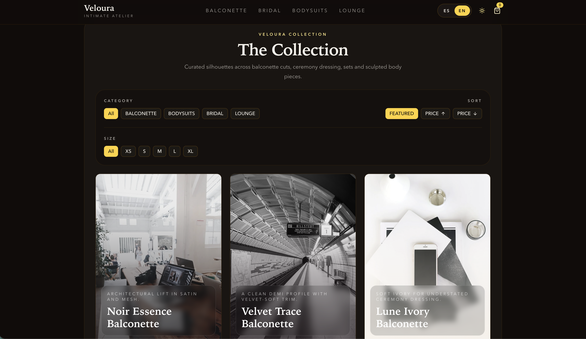
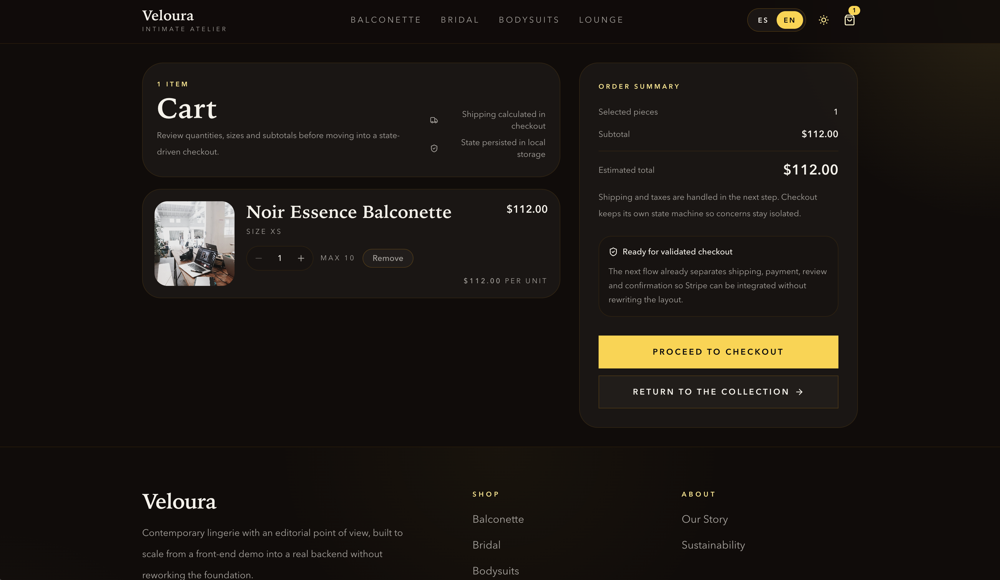
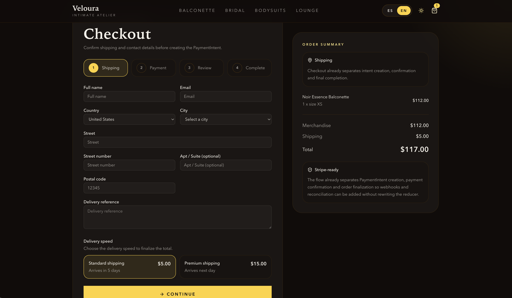
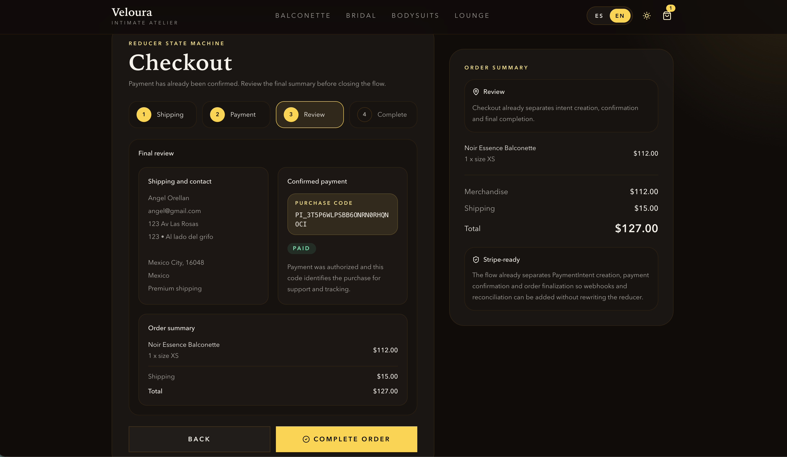
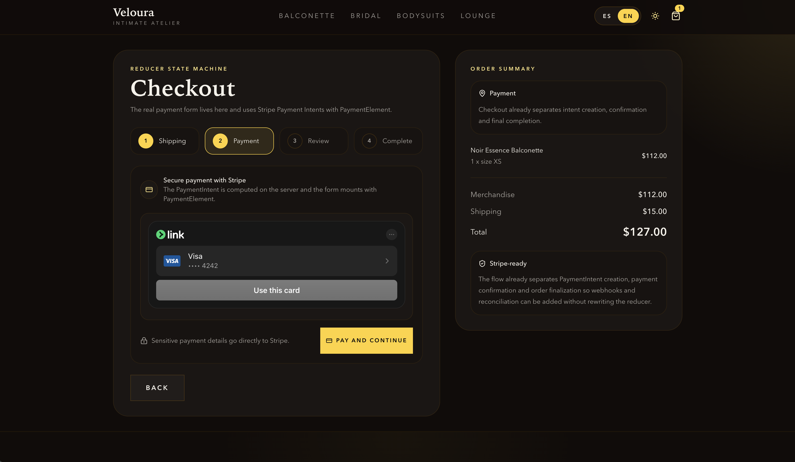
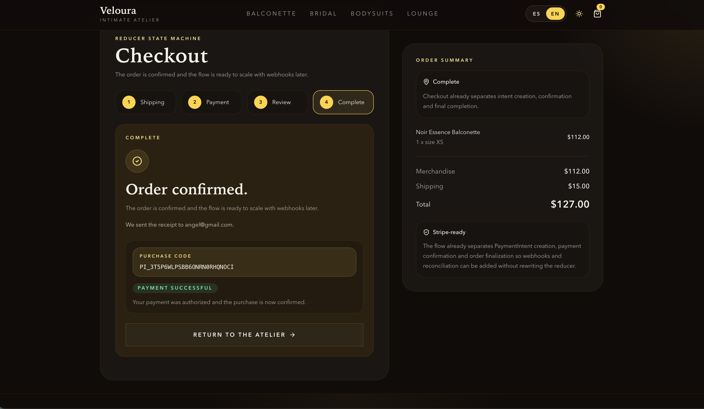
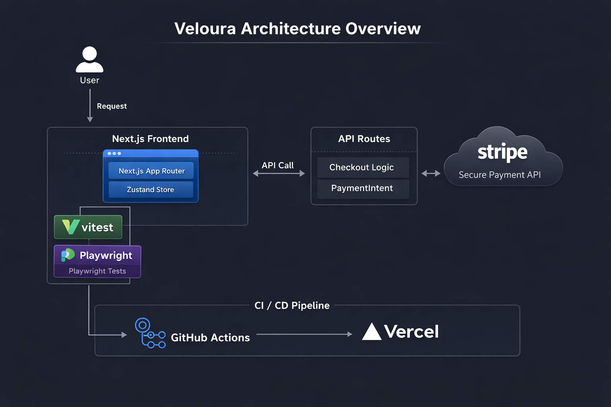

<p align="center">
  
</p>

<h1 align="center">Veloura</h1>

<p align="center">
  <strong>Modern editorial ecommerce built with Next.js and Stripe</strong>
</p>

<p align="center">
  
  
  
  
  
  
</p>

## Live Demo

Production: [https://veloura-qcx1l3hju-luis-angel-s-projects.vercel.app/](https://veloura-qcx1l3hju-luis-angel-s-projects.vercel.app/)

## Project Overview

Veloura is an editorial-style ecommerce experience designed with a luxury visual language and production-focused frontend architecture. The project combines a high-fidelity storefront with a deterministic checkout flow, typed state boundaries, and platform-level tooling that reflects senior frontend engineering standards.

Core product goals:

- Editorial ecommerce presentation with a refined dark/light visual system
- State-driven checkout powered by a reducer-based state machine
- Stripe PaymentIntent integration with a server-side intent creation flow
- CI/CD validation covering quality gates and end-to-end critical path testing

The result is a frontend that is visually polished, operationally safe, and structured to scale toward a real backend without rewriting the UI layer.

## Screenshots

### Home


### Product Grid



### Product Detail


### Cart



### Checkout – Shipping



### Checkout – Review



### Checkout – Payment



### Order Complete



## Architecture



Veloura is structured around a frontend architecture that keeps UI, domain logic, and platform concerns clearly separated:

- **Next.js App Router**
  The application uses the App Router model to organize pages, API routes, metadata, and route-level composition. This keeps the storefront, checkout, SEO metadata, and server endpoints aligned in one coherent project structure.

- **Client State Management**
  Zustand is used for global client state, specifically for cart persistence and filtering state. This keeps cross-route commerce state predictable without pushing transient UI logic into the component tree.

- **Checkout Reducer / State Machine**
  Checkout runs on a reducer-backed state machine (`shipping -> payment -> review -> complete`). This provides explicit transitions, deterministic validation, and a safer foundation for future integrations such as webhooks, order persistence, and payment reconciliation.

- **API Routes**
  App Router route handlers power local mock catalog APIs and the Stripe PaymentIntent creation endpoint. The server computes trusted totals, validates payloads, and avoids leaking sensitive payment logic to the client.

- **Stripe PaymentIntent Server-Side Flow**
  The client mounts a payment UI and confirms payment, while the server is responsible for creating the PaymentIntent with the final amount, receipt email, and shipping details. This keeps secret handling server-only and mirrors a production payment architecture.

- **CI/CD Flow (GitHub Actions -> Vercel)**
  GitHub Actions enforces required checks on pull requests and pushes to `main`, while Vercel handles preview and production deployments. This creates a clean path from validated code to deployment without manual release steps.

## Tech Stack

### Frontend

- Next.js (App Router)
- TypeScript (strict)
- Zustand (state management)

### Payments

- Stripe (PaymentIntent API)

### Testing

- Vitest (unit tests)
- Playwright (E2E critical path testing)

### DevOps

- GitHub Actions
- Vercel Deployment

## Local Development

Install dependencies:

```bash
npm install
```

Run the development server:

```bash
npm run dev
```

Run unit tests:

```bash
npm run test
```

Run end-to-end tests:

```bash
npm run e2e
```

Open Playwright in UI mode:

```bash
npx playwright test --ui
```

Open the Playwright HTML report:

```bash
npx playwright show-report
```

## Environment Variables

| Variable | Description |
|----------|-------------|
| `NEXT_PUBLIC_STRIPE_PUBLISHABLE_KEY` | Public Stripe key exposed to the client for loading the payment runtime |
| `STRIPE_SECRET_KEY` | Server-side Stripe secret used only when creating PaymentIntents |

### Test vs Live Keys

- **Test keys** should be used during local development, staging, and any non-production verification flow.
- **Live keys** should only be configured in secure production environments such as Vercel project settings.
- The client must only receive `NEXT_PUBLIC_STRIPE_PUBLISHABLE_KEY`.
- `STRIPE_SECRET_KEY` must never be exposed in client code, browser bundles, or CI logs.

## CI/CD

The project includes a professional CI pipeline designed for pull request safety and fast feedback:

- **Pull request validation**
  Every PR runs required checks before merge. The pipeline validates linting, TypeScript, unit tests, and the critical E2E commerce flow.

- **Required checks**
  The two enforced jobs are:
  - `quality`
  - `e2e`

- **Artifact uploads**
  The E2E workflow uploads artifacts on every run, including failures:
  - `playwright-report/`
  - `test-results/`
  Unit coverage is uploaded from the quality job.

- **Automatic Vercel deployment**
  Once code is merged and the repository is connected to Vercel, deployment can proceed automatically through Vercel’s standard preview/production flow.

## Testing Strategy

The test suite intentionally focuses on the route that matters most:

- reducer and validation logic for checkout
- cart total integrity in integer cents
- end-to-end customer path from product selection to completed order

This keeps the suite fast, deterministic, and genuinely useful without introducing excessive mocking or low-value snapshot coverage.

## Future Improvements

- Stripe webhooks for post-payment reconciliation
- Order persistence backed by a real database
- Automated email receipts and order notifications
- Multi-language support beyond the current UI-level selector
- Admin dashboard for catalog, inventory, and order operations

## Branch Protection Recommended

Recommended GitHub branch protection for `main`:

- Require status checks: `quality` and `e2e`
- Require pull requests before merging
- Require branches to be up to date before merge
- Disallow direct pushes to `main`
